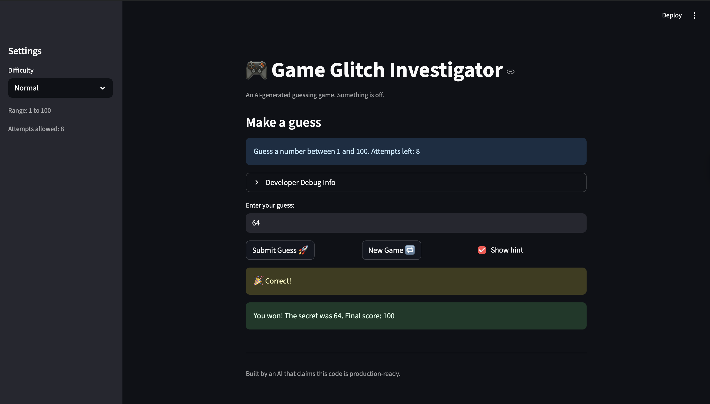

# 🎮 Game Glitch Investigator: The Impossible Guesser

## 🚨 The Situation

You asked an AI to build a simple "Number Guessing Game" using Streamlit.
It wrote the code, ran away, and now the game is unplayable. 

- You can't win.
- The hints lie to you.
- The secret number seems to have commitment issues.

## 🛠️ Setup

1. Install dependencies: `pip install -r requirements.txt`
2. Run the broken app: `python -m streamlit run app.py`

## 🕵️‍♂️ Your Mission

1. **Play the game.** Open the "Developer Debug Info" tab in the app to see the secret number. Try to win.
2. **Find the State Bug.** Why does the secret number change every time you click "Submit"? Ask ChatGPT: *"How do I keep a variable from resetting in Streamlit when I click a button?"*
3. **Fix the Logic.** The hints ("Higher/Lower") are wrong. Fix them.
4. **Refactor & Test.** - Move the logic into `logic_utils.py`.
   - Run `pytest` in your terminal.
   - Keep fixing until all tests pass!

## 📝 Document Your Experience

### Game Purpose
A number-guessing game where the player picks a difficulty (Easy, Normal, or Hard), then tries to guess a randomly chosen secret number within that difficulty's range. After each guess, the game tells the player whether to go higher or lower. The player wins by guessing the number before running out of attempts.

### Bugs Found

| # | Bug | Where |
|---|-----|--------|
| 1 | Hint messages were reversed — "Go HIGHER!" when the guess was too high, "Go LOWER!" when too low | `app.py` → `check_guess` |
| 2 | On every even-numbered attempt, the secret was silently cast to a `str`, causing lexicographic comparison (e.g. `50 > "9"` is `False`) and producing wrong hints | `app.py` submit block |
| 3 | The info banner always said "1 to 100" regardless of difficulty | `app.py` `st.info` call |
| 4 | Hard mode range (1–50) was smaller than Normal (1–100); ranges were effectively swapped | `app.py` → `get_range_for_difficulty` |
| 5 | New Game button used hardcoded `random.randint(1, 100)` instead of the current difficulty's range | `app.py` new_game block |
| 6 | All logic functions in `logic_utils.py` raised `NotImplementedError`, so `pytest` failed | `logic_utils.py` |
| 7 | `attempts` was initialized to `1` instead of `0`, making the attempt counter off by one from the start | `app.py` session state init |
| 8 | `update_score` added +5 points on even-numbered wrong guesses instead of always subtracting | `app.py` → `update_score` |
| 9 | Switching difficulty mid-game kept the old secret number from the previous range | `app.py` — no difficulty-change detection |
| 10 | Guesses outside the difficulty's range were accepted without error | `app.py` — no range validation |

### Fixes Applied

- **Reversed hints**: Swapped the return values in `check_guess` so `guess > secret` → "Go LOWER!" and `guess < secret` → "Go HIGHER!"
- **String comparison bug**: Removed the even/odd secret-to-string conversion; `check_guess` now always compares two integers
- **Hardcoded range label**: Updated `st.info` to use `{low}` and `{high}` from `get_range_for_difficulty`
- **Wrong difficulty ranges**: Hard mode changed to 1–500 (largest range = hardest)
- **New Game ignored difficulty**: Changed `random.randint(1, 100)` to `random.randint(low, high)`
- **logic_utils.py**: Implemented all four functions (`get_range_for_difficulty`, `parse_guess`, `check_guess`, `update_score`) so `pytest` passes
- **Attempts off-by-one**: Changed `attempts` initialization from `1` to `0`
- **Unfair score bonus**: `update_score` now always subtracts 5 for any wrong guess
- **Difficulty-change reset**: App now detects when difficulty changes in the sidebar and resets the game automatically
- **Range validation**: Guesses outside `[low, high]` are rejected with an error and don't count as an attempt

## 📸 Demo

- 
